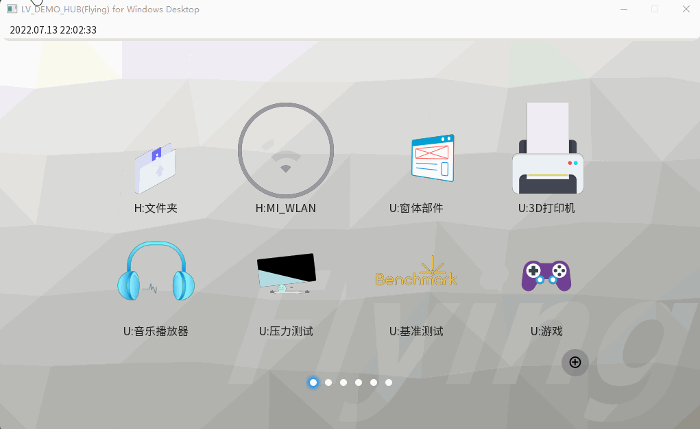
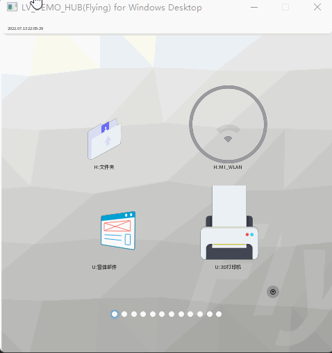

<!--
 * @Author: Flying
 * @Date: 2022-02-25 20:58:21
 * @LastEditors: Flying
 * @LastEditTime: 2022-07-20 20:34:18
 * @Description: README
-->
## 一、概述

- LVGL DEMO 仓库
- 目的：可快速评估LVGL组件，了解LVGL能做些什么
- 支持：ubuntu(gcc)、windows(X64 vs2022)、linux arm（sigmastar SSD2XX）
- [视频演示 https://www.bilibili.com/video/BV1G94y1Q7i3?share_source=copy_web&vd_source=96eea623fa6e1f143b5307f823819f90](https://www.bilibili.com/video/BV1G94y1Q7i3?share_source=copy_web&vd_source=96eea623fa6e1f143b5307f823819f90)

- 1024*600 效果



- 480*480 效果



## 二、特点

- 1、一个工程支持三种运行环境:

  - windows : 可利用vs2019 的调试方便，快速预览UI应用
  - Ubuntu ： 更贴近linux arm 的linux环境，可快速调试预览应用
  - SSD2xx ：linux arm 运行环境，非SSD2xx平台也可参考该模式

- 2、自适应布局

  - 硬件设备分辨率不同，可在运行时自适应分辨率，显示出不同的效果
  - SSD2xx平台下会读取fb信息自动自适应分辨率

- 3、高灵活度（支持LVGL V8.x.x 版本）

  - 无修改LVGL 源码，方便修改自己喜欢的release版本进行调试评估

- 4、多应用支持

  - 官方LVGL example 合一，一个demo可评估LVGL所有控件以及LVGL性能

- 5、丰富动画

## 三、下载编译

``` shell
  git clone  https://gitee.com/mFlying/lv_demo_hub.git
```

### VS2019编译说明

1. 双击`lv_demo_hub.sln`打开

### ubuntu 编译说明

- 安装依赖`sudo apt-get update && sudo apt-get install -y build-essential libsdl2-dev`
- 编译：

```shell
  mkdir build
  cd build
  cmake .. -DFLYING_PLATFORM="ubuntu"
  make -j8
```

- or

```shell
./build_all.sh -j8
```

### ssd2xx交叉编译说明

- 编译：

```shell
  mkdir build
  cd build
  cmake .. -DFLYING_PLATFORM="linuxarm" -DCMAKE_TOOLCHAIN_FILE="./cmake_conf/toolchain.cmake"
  make -j8
```

- or

```shell
./build_all.sh -ssd2xx -j8
```

- 运行说明：

  - 该DMEO 无点屏操作，运行该demo之前必须先初始化panel，点屏参考见 [Flying/ssd2xx-demo](https://gitee.com/mFlying/ssd2xx-demo/blob/master/2.panel/README.md)
  - 该DEMO 自适应分辨率，但不适应位深，需要根据平台，修改`lv_conf.h`中的`LV_COLOR_DEPTH`后重新编译(DEMO 默认为ARGB8888)
  
- 运行：

- `./run.sh ` 双buffer fb
- `./run.sh 0` 单buffer fb
- `./run.sh 1` 旋转90度
- `./run.sh 2` 旋转180度
- `./run.sh 3` 旋转270度

## 四、文件说明

```
.
├── application             //应用
│   ├── app                 //LVGL 纯UI DEMO
│   ├── CMakeLists.txt    
│   ├── hw_app              //与硬件相关DEMO（TODO）
│   ├── sys                 //lv_demo_hub 系统类
│   ├── wm_application.cpp  //应用main
│   └── wm_application.h
├── arm_run.sh              //linux上 运行的简易脚本
├── base_main.h             
├── base_main_linuxarm.h    //linuxarm 环境下的main
├── base_main_ubuntu.h      //ubuntu 环境下的main
├── base_main_windows.h     //windows 环境下的main
├── build                   //cmake 编译时中间文件
├── build_all.sh            //全编译简易脚本（ubuntu、linuxarm）
├── build_out               //编译后的可执行文件（ubuntu、linuxarm）
├── cmake_conf              //cmake 配置文件，交叉编译工具指向
├── CMakeLists.txt    
├── common                  //通用接口
├── libs                    //包含常用lib，以及SSD2xx平台的MI lib（ssd2xxSDK下的复制）
├── lv_conf.h               //LVGL 配置文件
├── lv_demo_hub.sln         //VS2019执行文件（向上支持)
├── lv_demo_hub.vcxproj
├── lv_demo_hub.vcxproj.filters
├── lv_demo_hub.vcxproj.user
├── lv_drv_conf.h           //LVGL 驱动相关配置文件
├── lvgl                    //LVGL core 源码
├── lv_lib_100ask           //100ask 开源 lvgl 方案参考（非最新，https://gitee.com/weidongshan/lv_lib_100ask.git）
├── lv_lib_100ask_conf.h
├── main.cpp    
├── my_conf.h               //该demo 配置文件
├── my_def.h                //该demo 宏定义文件
├── my_drivers              //官方lv_drivers，针对SSD2xx硬件有对应优化修改
├── my_lib                  //需要修改官方组件时，拷贝一份进行自定义修改，避免修改到LVGL源码
├── preview.gif
├── README.md
├── resource                //资源文件（图片、字体等）
└── tool                    

```

## 五、联系

- 问题可提 issues 讨论
- 邮件： weekend@111.com
